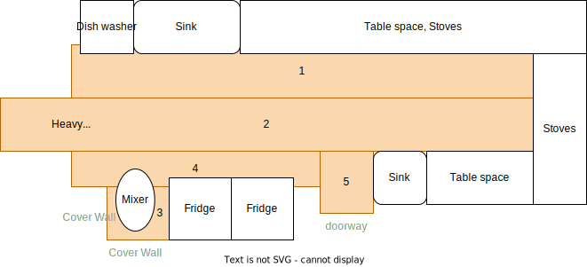

# Troop 160 Pancake Breakfast Flooring

This page describes the instructions for how to protect the kitchen floor during and save time for cleanup after the annual pancake breakfast.

1. Make sure you have about 1.5 rolls of the usual flooring material along with about 1.5 rolls of duct tape and a good utility knife.
1. Clean out all moveable stuff, except the 2 large fridges which are probably already full of the stuff.
1. Basic strategy, mainly in the order;

Tips;
- Try to minimize the seams (=duct tape) to end up in the middle of presumed heavy traffic areas.
- Use any scrap pieces to cover the rest.
- Cover 1-2 ft of bottom of the walls/fridges where the mixer could splash around.